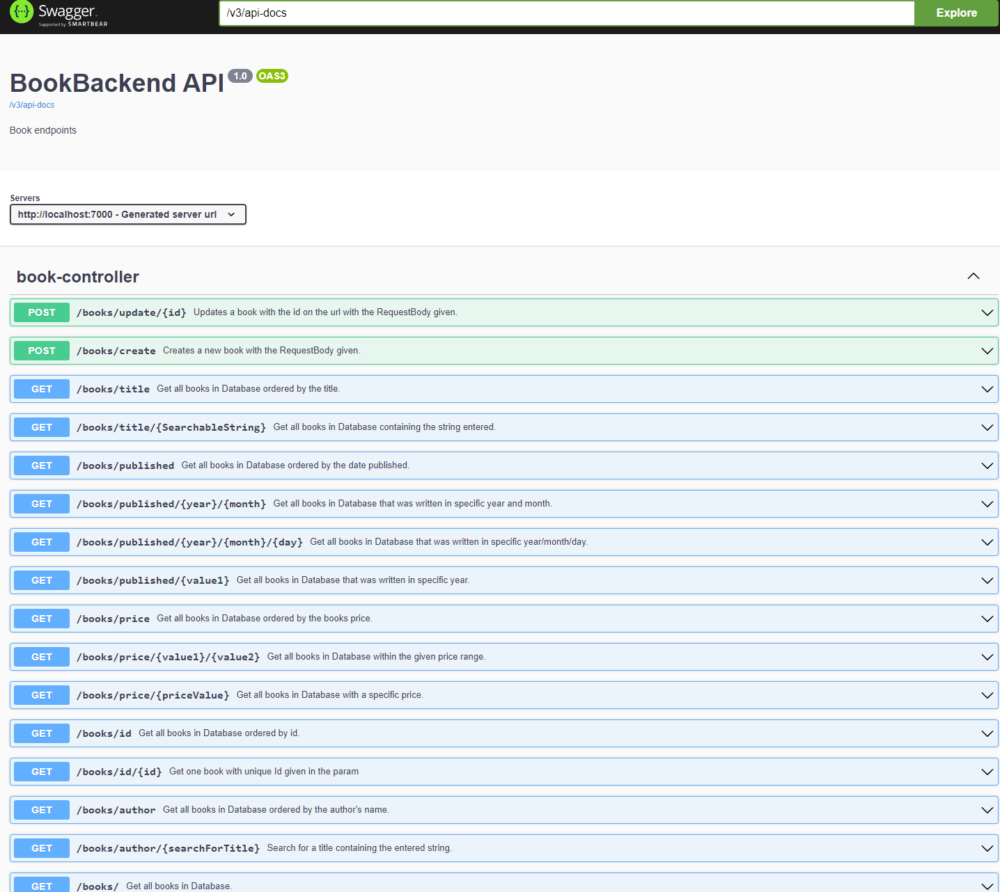

# BookBackend Details
### Using: 
* SpringBoot 3.0
* MySQL as datasource
* OpenAPI 3.0 (Swagger)

# API Documentation using OpenAPI 3.0 
- Visit: {http:://yourUrl}/SwaggerApiDocumentation
example on localhost: http://localhost:7000/SwaggerApiDocumentation

# Getting Started
- Clone Repo
- Create a MySQL database
- Add the database csv file to your database. 
- Modify the application.yml with database settings
  - Check Database name and match it to the DB created
  - Check User and password 

### Swagger: 

### Workdescription 
https://drive.google.com/drive/u/0/folders/1YCbIS8iMMWdyaB1zX3W8DRbAN5GBtLw3
